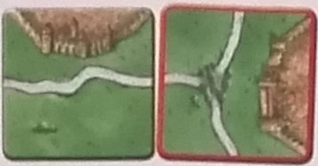
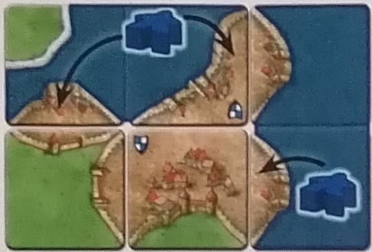
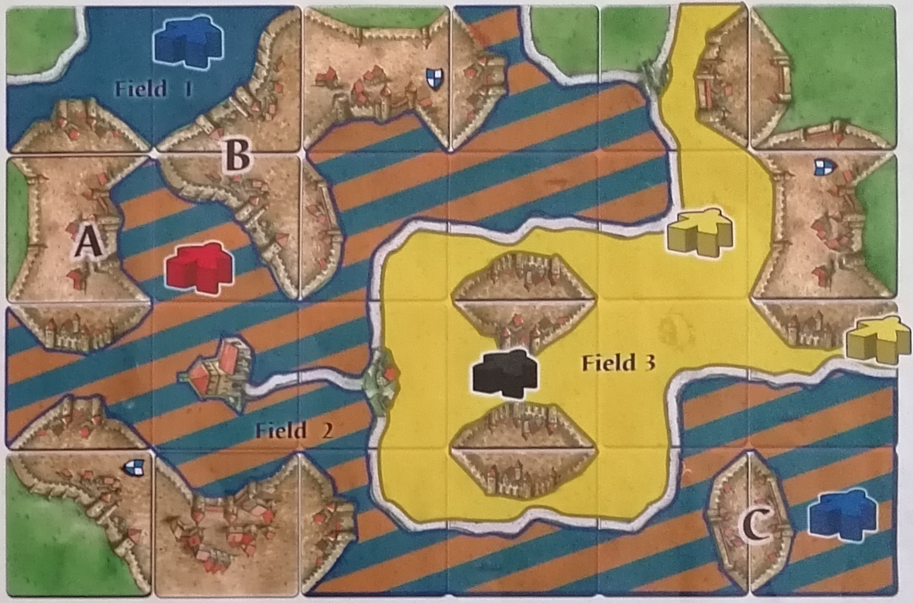
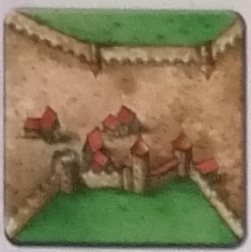

Available from [Z-MAN games](HTTP://www.zmangames.com)

A tile laying game for 2 to 5 players, by Klaus-Jürgen Wrede. Ages 13 and up.
Carcassonne, the world-famous French city, known for its imposing
fortifications erected during the Antiquity and the Middle Ages.
This fortress, surrounded by magnificent walls, still stands today as one
of the most unique French cities. In this game, players must develop the area
around Carcassonne. They will place their followers onto roads and into
cities, monasteries and fields. Only those who make the most judicious
placements will gain the points required to win the game.

## Components


* 72 Land tiles (including 1 Start tile with a darker back) showing
roads, cities, fields and monasteries.
  * Back of the start tile: 
    * 
  * Back of the normal tiles: 
    * 
  * 
* 12 River tiles (They have the same back as the Start tile, 
but are not part of the basic game. Play at least one game without these 
tiles before using them. The rules under [Rules for River Tiles](./rules.md#rules-for-the-river-mini-expansion-12-tiles))
* 40 followers (in 5 colours) 
  * 
    * Each follower may become a thief, a knight, a monk or a farmer.
    * Each player will use one of their followers as a score marker.
* 1 scoreboard: To track the players' scores. 
  * 
* 1 rulebook - this document!

## Game overview

On their turn, players place one tile. This is how roads, cities, 
monasteries and fields will be created, one tile at a time. To score points, 
players will need to place followers on these tiles. Points are scored 
throughout the game and at the end of the game. After the final scoring, 
the player who scored the most points is the winner.

## Game setup

The Start tile is placed face up in the centre of the table. 
Shuffle the other tiles and place them in various face-down stacks within 
reach of every player. Place the scoreboard close to the edge of the table 
to give players enough room to play their tiles in the middle of the table. 
Each player takes the 8 followers in their colour and puts one (called marker 
thereafter) on space 0 of the scoreboard (the space located in the lower 
right-hand corner). Each player then keeps their remaining 7 followers in 
front of themselves: this is their personal supply. Players choose how the 
first player is designated, or simply let the youngest player begin.

Start tile: 


## Playing the game

Players take their turn one after the other, starting with the first player 
and then proceeding clockwise: on their turn, a player must do the following 
actions in the order listed below:
1. Draw and place one new Land tile.
2. Then, the player may take one (1) of his followers from his supply and 
put it on the tile he has just placed. 
3. If by placing a Land tile, one or more roads, cities, and/or monasteries 
are completed, these features are scored immediately.

The player's turn is now over and the next player takes her turn by following 
the same rules.

### Placing Land tiles
At the beginning of their turn, a player must draw one of the face-down Land 
tiles. She looks at it and shows it to the other players (allowing them to 
"help" her). Then, she places that tile on the table according to the 
following rules:
* The new tile (the one with a red border in the examples) must be placed in 
such a way that at least one of its sides touches one of the previously placed 
tiles. The new tile cannot only be connected by a corner. 
* New tiles must always continue: fields, cities and/or roads.
* In the unlikely situation where a drawn tile cannot be placed 
(all players must agree), the player removes the tile from the game and 
draws another tile.
 
Examples:
* 
  * The new tile continues the road and field sections. 
* 
  * The new tile continues the city section.
* 
  * One side of the new tile continues the city and the other continues the field. 
* 
  * This placement is not allowed. 

### Placing new followers
Once a player has placed her tile, she can put one of her followers on that 
tile according to these rules:
* A player may only place 1 follower per turn.
* The player must take the follower from her supply.
* The player may only put the follower on the tile she has just placed.
* The player must choose where she will place her follower. As such, the 
follower can become a ...
  * Thief 
    *  
    * *on a road section*
  * Knight 
    *  
    * *in a city section*
  * Monk 
    *  
    * *in a monastery*
  * Farmer 
    *  here or here
    * *in a field* 
    * **(Lay down your farmers!)**
* (For your first game, it is best to play without the farmers.)
* The player may not place her follower on a road, in a city or in a field if 
that section is connected to another tile where there already is a follower 
(no matter which player owns that follower). For example:
  * 
    * Blue may only place a farmer or a monk since there already is a thief on 
    the continued road.
  * 
    * Blue cannot place his follower as a knight because the city is already 
    occupied. He may, however, place a thief on the road or a farmer in the field.

If a player has placed all of her followers, she keeps placing one tile each 
turn. A player is never allowed to retake one of her followers from a tile. 
However, a follower is returned to its supply when the road, city or monastery 
it occupies is scored.
Then, the player's turn is over. After, in clockwise order, the next player 
takes his turn, followed by the next one, etc.

**IMPORTANT:** If, after placing a tile, one or more roads, cities and / or 
monasteries are completed, they are immediately scored before the next 
player's turn.

### Scoring completed roads, cities and monasteries

#### THE SCOREBOARD

When you score points, move your marker a number of spaces on the scoreboard 
equal to the number of points scored. If you move beyond space 50 of the 
scoring track, put your marker on its side to indicate that you now have 
more than 50 points and keep moving your marker as usual on the scoring track.
* 
  * Blue scores 3 points.
  * He moves his marker from space 48 to space 1.
  * He then lays his marker on its side to show that he passed space 50.

#### A COMPLETED ROAD


A road is complete once both ends of the road are connected to a crossroad, 
a city section, a monastery or the road loops onto itself. There can be any 
number of road sections between both ends.
A player who owns a thief on a completed road scores 1 point per tile used in 
the completed road (make sure that you only count the number of tiles, since a 
single tile can be used for more than one road section).
* 
  * Red scores 4 points.
* 
  * Red scores 3 points.

#### A COMPLETED CITY


A city is complete when it is surrounded by walls and there are no gaps in the 
walls or the city. There can be any number of sections in a city.
A player who owns a knight in a completed city scores 2 points per tile in the 
city (count the tiles and not the sections). Each banner in the scored city 
also gives the player 2 points.
* 
  * Red scores 8 points (3-tile city and 1 banner).
* 
  * When 2 city sections are on the same tile, it is worth only 2 points since 
  it counts as 1 tile.
  * Red scores 8 points (4-tile city and no banners).

#### WHAT IF THERE ARE MORE THAN ONE FOLLOWER ON A COMPLETED ROAD OR CITY?
With some clever tile placements, it is possible to connect road and city 
sections, resulting in a road with more than one thief or a city with more 
than one knight.
* The player with the most thieves or knights scores the totality of the points.
* In case of a tie, the tied players each score the points.
* Example: The new tile connects the city sections to create one larger city. 
* Blue and Red both score 10 points for this city (made out of 5 tiles) since they have one knight each in that completed city. 
* For another scoring example with followers placed in the same feature, see “Scoring Incomplete Cities, Roads And Monasteries” below.

#### A COMPLETED MONASTERY


A monastery is complete when it is surrounded by tiles. The player who owns a 
monk in a completed monastery scores 9 points (1 point per tile, including the 
tile with the monastery).
* 
  * Red scores 9 points (the monastery tile itself and the 8 surrounding tiles).

#### FOLLOWERS GO BACK INTO THEIR PLAYER'S SUPPLY

After scoring a road, a city or a monastery - and only then - the followers 
used in the scoring are returned to their player's supply. These returned 
followers may become thieves, knights, monks and farmers during the following 
turns.

It is possible for a player to place a follower, score a road, a city or a 
monastery and see this same follower return into their supply on the same turn. 

Examples:
* 
  * Red scores 3 points.
* 
  * Red scores 4 points.

The order must always be as follows:
1. Complete a road, a city or a monastery with the new tile.
2. Place a thief, knight or monk.
3. Score the completed road, city or monastery.
4. Return the thief, knight or monk to its supply.

#### THE FIELDS

*(Reminder: for your first game, we recommend playing without farmers and fields.)*

Connected field sections create a larger field. Fields are not scored during 
the game. Players are allowed to place farmers into a field section, but those 
are only scored at the end of the game. A farmer remains in the  field where 
it was placed until the end of the game and is never returned to its player's 
supply! (To show this, lay the farmer on the tile instead of placing it 
standing up.) Fields are separated from one another by roads, cities and the 
edge of the board. (This is particularly important during the final scoring!)
* 
  * All three farmers have their own field. The road sections and the city 
  divide the field into three distinct fields. 
* 
  * By placing this new tile, the three fields become one single field where 
  each player has one follower.

**Note:** The player who placed this new tile can-not put a new farmer in the 
field since there already is at least one farmer (three in this case) in the 
connected fields.

### Game end and final scoring
When a player places the last tile, the game ends after his turn. 
Then, players proceed with the final scoring.

#### SCORING INCOMPLETE CITIES, ROADS AND MONASTERIES
During the final scoring, incomplete roads, cities and monasteries are scored. 
A player who has a follower on an incomplete road, city or monastery scores 
1 point per tile. For cities, each banner is also worth only 1 point. 
In case of a tie, use the same rules as for completed features.

Once a feature is scored, return the follower to its supply. 
This should prevent any potential mistakes during the final scoring.

Example:
* 
  * Green scores & points for the incomplete city (5 city sections and 3 banners).
  * Black scores nothing since Green has more knights than him in this city.
  * Red scores 3 points for the incomplete road (3 road sections).
  * Yellow scores 5 points for the incomplete monastery 
  (the monastery tile itself and the 4 surrounding tiles).
  * Blue scores 3 points for the incomplete city (2 city sections and 1 banner).

#### SCORING FARMERS
*(For your first game, if playing without farmers and fields, 
you will not need to score them.)*
* When scoring the farmers, only completed cities are counted.
* The farmer must be in a field that touches one or more completed cities. 
The distance between the farmer and the city does not matter.
* For each completed city that the field touches, the player with the most 
farmers in that field scores 3 points. The size of the city does not matter. 
If some players are tied for the most farmers, they each score the points for 
that field.
* A field is only worth points if it touches at least one completed city. 
More than one field may touch and score the same completed city. 
Each field is scored by following the rules above.

Examples:
* 
  * Blue scores 6 points. Red scores 3 points.
  * No one scores points for the incomplete city.

* 
  * Blue scores 9 points 
  (6 points for the top farmer, and 3 points for the bottom farmer). 

In following examples:  
Shows the order in which the tiles are placed.
* 
  * Blue has the small field, and he scores 3 points for city A.
  * Yellow does not have the most farmers in the field, 
  and therefore does not score any points.
  * Red owns the large field since he has the most farmers. 
  He scores 6 points (3 for each city, A and B).
* 
  * Blue scores 3 points for city A.
  * In this example, Red and Yellow both have 2 farmers and score 6 points each 
  (3 points each for cities A and B).

Once all fields have been scored, the final scoring and the game are over.

The player with the most points is the winner. 
In case of a tie, play another game to determine the winner!

### RULES FOR THE RIVER MINI-EXPANSION (12 TILES)

When playing with the River mini-expansion, 
the beginning of the game is changed as follows:
Remove the Start tile from the game. 
Begin the game by placing the source of the river face up in the centre of the 
table and set aside the tile with the lake. 
Shuffle the 10 remaining River tiles face down, 
and start the game by drawing the River tiles before using the regular tiles. 
Lay these tiles in order to continue the river, 
making sure that you never place 2 bends (turns) in the same direction 
one after the other. Players are allowed to place followers on these tiles, 
just like in the basic game. However, no followers are allowed on the river. 
Once the last of the 10 River tiles has been placed, 
the next player places the lake and then the game continues normally. 

**Note:** Players should always keep in mind where the river is heading 
to ensure that it ends.

## Detailed examples

### DETAILED FARMER SCORING EXAMPLES

Here is another example for scoring farmers (followers placed in fields). 
The full explanation for scoring farmers can be found under “Scoring Farmers”.
* 
  * Field 1: Blue is a points.

**Note about field demarcations:** Fields are separated from one another by 
roads and cities as well as the edge of the board.

### HOW CAN MORE THAN ONE FOLLOWER OCCUPY THE SAME FIELD?

 = last tile placed

* 
  * Turn 1
    * Blue puts a farmer in the field.
* 
  * Turn 2
    * Corners never connect tiles! Here, the fields are not connected.
    * Red places a tile diagonally adjacent to the one that Blue has just placed.
    * Red can put his farmer in the illustrated field since both fields are not 
    connected at that time.
* 
  * Turn 3
    * The two fields are now combined into a larger field.
    * There are now two farmers in the same field.

Using similar tactics, it is possible for two thieves to be on the same road 
or two knights to be in the same city.

## Basic game tiles

 These tiles are included in the game (plus the 12 River files, not shown)

**Note:** There can be cosmetic differences on these tiles (sheep, houses, etc.).

* 
  * A (monastery + road) * 2
* 
  * B (monastery) * 4
* 
  * C (full city + banner) * 1
* 
  * D (1 city by straight road) * 4
  * includes the Start tile (darker back)
* 
  * E (small city) * 5
* 
  * F (through city + banner) * 2
* 
  * G (through city) * 1
* 
  * H (2 separate 1 cities) * 3
* 
  * I (2 adjoined 1 cities) * 2
* 
  * J (1 city with corner road - right) * 3
* 
  * K (1 city with corner road - left) * 3
* 
  * L (small city with t-junction) * 3
* 
  * M (2 city + banner) * 2
* 
  * N (2 city) * 3
* 
  * O (2 city with corner road + banner) * 2
* 
  * P (2 city with corner road) * 3
* 
  * Q (3 city + banner) * 1
* 
  * R (3 city) * 3
* 
  * S (3 city with road + banner) * 2
* 
  * T (3 city with road) * 1
* 
  * U (through road) * 8
* 
  * V (corner road) * 9
* 
  * W (3-way junction) * 4
* 
  * X (4-way junction) * 1

### River tiles


### Scoring summary

| Features completed DURING the game |                                         |                            |                                      | Incomplete features at the END of the game                        |
|------------------------------------|-----------------------------------------|----------------------------|--------------------------------------|-------------------------------------------------------------------|
| Road (thief)                       | 1 point per tile                        |    | Road (thief)                         | 1 point per tile                                                  |
| City (knight)                      | 2 points per tile + 2 points per banner |  | City (knight)                        | 1 point per tile + 1 point per banner                             |
| Monastery (monk)                   | 9 points                                |      | Monastery (monk)                     | 1 point per tile (monastery tile and each surrounding tile)       |
|                                    |                                         |  | Farmers, only at the END of the game | 3 points per completed city in the field or adjacent to the field |

## Copyright and company details:

```
© 2012 Hans im Glück Verlags-GmbH
English version by:
2012-2014 Z-Man Games, Inc.
31 rue de la Coopérative
Rigaud QC JOP IPO Canada
```
```
Designer: Klaus Rügen-Wrede
Illustrator: Anne Pätzke
Rules layout: Christof Tisch
English version: Z-Man Games
```

### Questions, comments, requests?

```
www.zmangames.com
info@zmangames.com
Made in Germany
```
